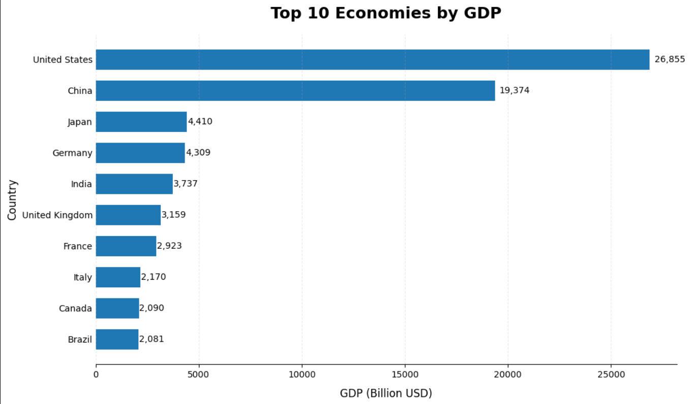

# Top 10 Economies by GDP (Web Scraping + Data Visualization)

A small data project that scrapes GDP data for countries from **Wikipedia**, cleans it with **pandas**, saves it as a CSV file, and visualizes the top 10 economies in a horizontal bar chart with **matplotlib**.



---

## 📌 Project Overview

This notebook answers a simple question: *which countries have the largest economies by nominal GDP?*

The data was **not** manually typed in — it was collected through **web scraping**: the notebook pulls the "List of countries by GDP (nominal)" table directly from Wikipedia (via an archived Wayback Machine snapshot, to keep the results reproducible even if the live page changes), then cleans and processes it with pandas.

The final, cleaned dataset is saved locally as **`Largest_economies.csv`**, and the top 10 economies are plotted in a horizontal bar chart, sorted from smallest to largest GDP for easy reading.

## 🗂️ Repository Contents

| File | Description |
|---|---|
| `notebook.ipynb` | Full workflow: scraping → cleaning → CSV export → visualization |
| `Largest_economies.csv` | Final cleaned dataset (Country, GDP in Billion USD) |
| `top_10_gdp.png` | Bar chart image of the top 10 economies |

## ⚙️ How the Notebook Works

1. **Install & import libraries** — `pandas`, `numpy`, `lxml` (needed to parse HTML tables) and `matplotlib` for plotting.
2. **Scrape the data** — `pd.read_html()` is used on a Wikipedia page (an archived Wayback Machine version of *"List of countries by GDP (nominal)"*) to automatically extract every HTML table on the page into a list of DataFrames.
3. **Select the right table** — out of all the tables found on the page, the relevant GDP table is picked out (`tables[3]`).
4. **Clean the data**:
   - Keep only the *Country* and *GDP* columns, and rename the columns for clarity.
   - Keep only the top 10 rows (the highest-ranked economies).
   - Convert the GDP column from text to numeric (`int`).
   - Convert GDP from millions to **billions of USD** and round to 2 decimal places.
5. **Export to CSV** — the cleaned DataFrame is saved as `Largest_economies.csv`, so the dataset can be reused without re-scraping the page every time.
6. **Visualize** — a horizontal bar chart is built with matplotlib:
   - Bars are sorted from smallest to largest GDP.
   - Each bar is labeled with its exact GDP value.
   - Top/right/left spines and axis ticks are removed for a clean, presentation-style look.

## 📊 Result

| Rank | Country | GDP (Billion USD) |
|---|---|---|
| 1 | United States | 26,854.60 |
| 2 | China | 19,373.59 |
| 3 | Japan | 4,409.74 |
| 4 | Germany | 4,308.85 |
| 5 | India | 3,736.88 |
| 6 | United Kingdom | 3,158.94 |
| 7 | France | 2,923.49 |
| 8 | Italy | 2,169.74 |
| 9 | Canada | 2,089.67 |
| 10 | Brazil | 2,081.24 |

## 🧰 Tech Stack

- Python
- pandas / numpy — data scraping & cleaning
- lxml — HTML table parsing engine for `pd.read_html()`
- matplotlib — data visualization
- Jupyter Notebook

## ▶️ How to Run

1. Clone this repository.
2. Install the requirements:
   ```bash
   pip install pandas numpy lxml matplotlib
   ```
3. Open `notebook.ipynb` in Jupyter Notebook / JupyterLab / VS Code and run all cells.

## 📎 Data Source

Data scraped from Wikipedia's *"List of countries by GDP (nominal)"* page (archived version via web.archive.org), correct as of the archive snapshot date. GDP figures are nominal, in current USD, and subject to change over time as newer estimates are published.

